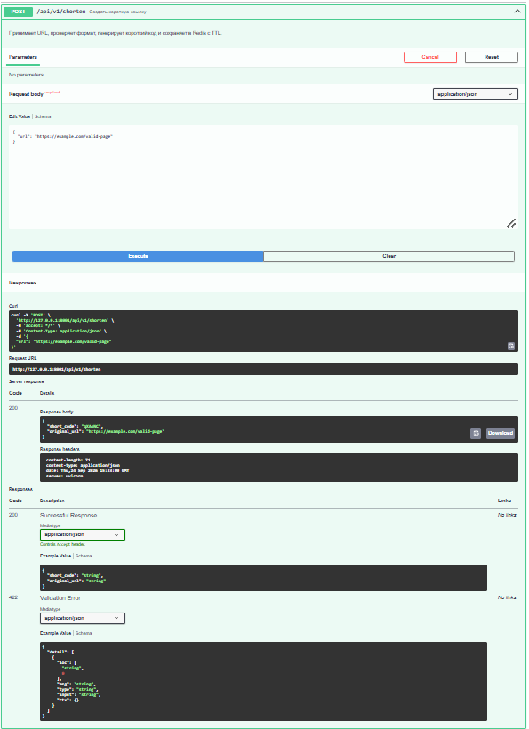
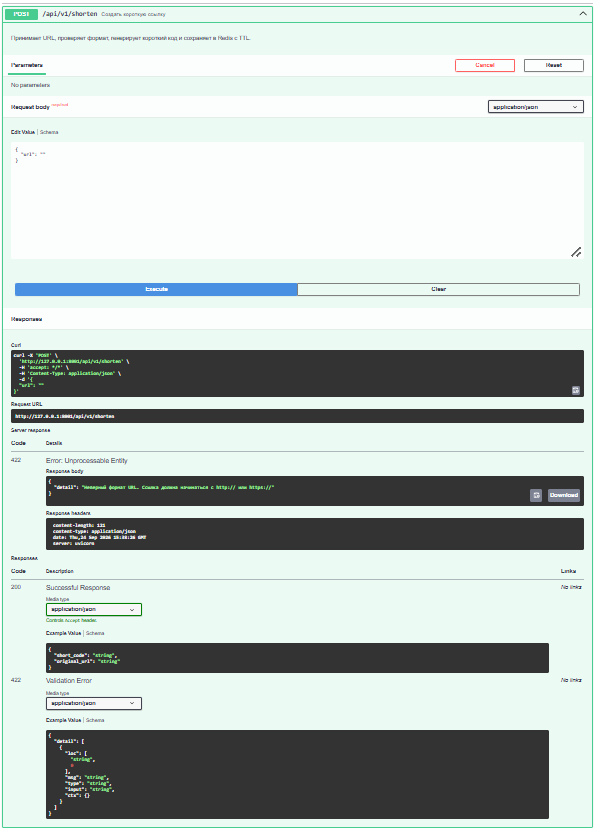
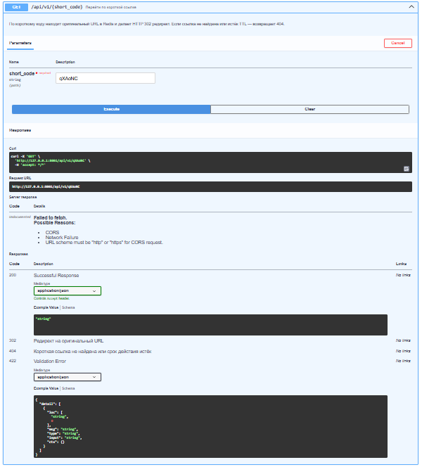
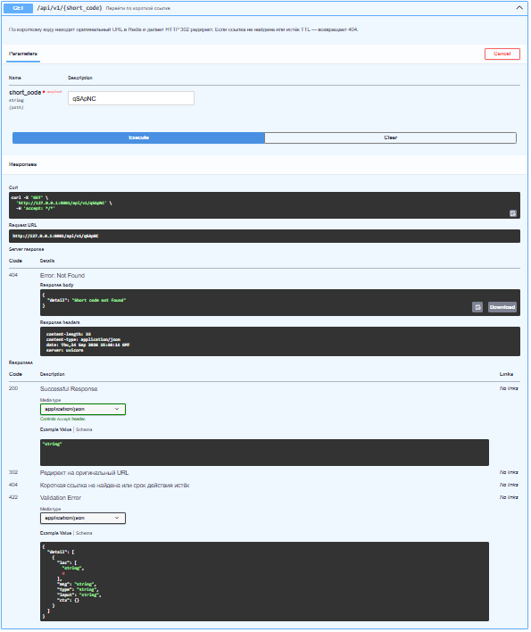

# URL Shortener API

Асинхронный сервис сокращения ссылок на FastAPI + Redis

## Стек технологий: 
FastAPI, Redis, Docker, pytest.
Redis выбран как быстрое хранилище ключ-значение: оно идеально подходит для хранения коротких ссылок, где важна минимальная задержка при чтении и записи, а также возможность легко задавать время жизни (TTL) для каждой ссылки.

## Как запустить

1. Соберите и запустите контейнеры:
   ```bash
   docker compose up --build
   ```
2. Откройте Swagger-документацию:
   `http://127.0.0.1:8001/docs`

## Как запустить тесты

   ```bash
   docker compose run --rm test
   ```
Тесты выполняются в отдельном контейнере с подключённым Redis. Приложение при этом не поднимается.
Если изменили `requirements.txt` — пересоберите образ:
   ```bash
   docker compose run --rm --build test
   ```
## Как остановить

   ```bash
   docker compose down
   ```
## Эндпоинты

| Метод | Путь | Описание | Входные данные (Body) | Ответ |
| :---: | :--- | :--- | :--- | :--- |
| POST | `/api/v1/shorten` | Создает короткую ссылку для переданного URL | ``{"url": "https://example.com"}`` | ``{"short_code": "abc123", "original_url": "https://example.com"}`` |
| GET | `/api/v1/{short_code}` | Выполняет редирект (302) на оригинальный URL | — | HTTP 302 → `Location: <original_url>` |
| GET | `/` | Проверка статуса сервиса (healthcheck) | — | ``{"message": "URL Shortener API is running"}`` |

### Примеры запросов

**Создание ссылки:**
   ```bash
   curl -X POST http://127.0.0.1:8001/api/v1/shorten \
     -H "Content-Type: application/json" \
     -d '{"url": "https://www.google.com"}'
   ```
Ожидаемый успешный ответ (HTTP 200 OK):
   ```json
   {
     "short_code": "abc123",
     "original_url": "https://www.google.com"
   }
   ```
Ошибка: невалидный URL (POST с ошибкой):

Если отправить ссылку без протокола, сервер вернёт ошибку валидации.
   ```bash
   curl -X POST http://127.0.0.1:8001/api/v1/shorten \
     -H "Content-Type: application/json" \
     -d '{"url": "google.com"}'
   ```
Ожидаемый ответ (HTTP 422 Unprocessable Entity):
   ```json
   {
     "detail": "Неверный формат URL. Ссылка должна начинаться с http:// или https://"
   }
   ```
**Проверка редиректа (GET)**

Команда (запрос только заголовков, чтобы увидеть 302):
   ```bash
  curl -I http://127.0.0.1:8001/api/v1/abc123
   ```
Ожидаемый ответ:
   ```text
   HTTP/1.1 302 Found
   location: https://www.google.com
   server: uvicorn
   date: Sun, 22 Sep 2026 10:00:00 GMT
   content-length: 0
   ```

### Примеры ответов API

  
*Успешное создание короткой ссылки при корректных данных.*

  
*Ошибка 422 при отсутствии обязательного поля `url` в запросе.*

  
*Успешный редирект на оригинальный URL по существующему коду.*

  
*404 при запросе несуществующего короткого кода.*
